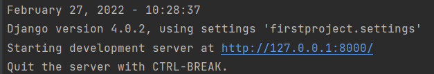

# Project Using Django

## Steps to download django on your device
Step 1: Create a **Project** in Pycharm.<br>
Step 2: Open a terminal and write the following code.
```md
pip install django
```
Step 3: After successfully installation of django, go to command prompt to verify.<br>
Step 4: Open the command prompt on your device and write the following command:
```md
python -m django --version
```
## Steps to create first project using django
Step 1: Write the following command on the terminal of Pycharm.
```md
django-admin startproject firstproject
```
Note: Here, **firstproject** is the name given to the project, which you can change as per your choice. <br>

Step 2: To change the directory to **firstproject**, write the following command:
```md
cd firstproject
```

Step 3: Now write the following command:
```md
pyhton manage.py runserver
```

Step 4: Terminal will give you output as follows:<br>

